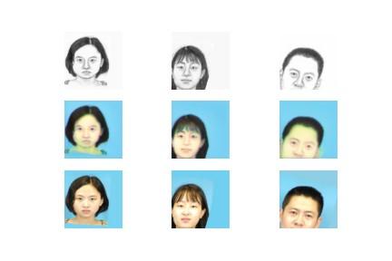
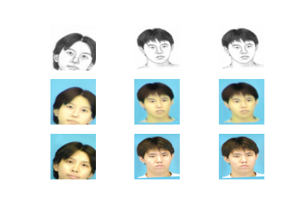

# Face Sketch to Image Generation using GAN

This repository contains the code for implementing an image generation system using GAN (Generative Adversarial Networks) to turn face sketches into realistic photos. 

### Contents
* [Getting started](#getting-started)
* [Data Augmentation](#data-augmentation)
* [Training](#training)
* [Performance Measurement](#performance-measurement)
* [Testing](#testing)
* [References](#references)

## Install requirements
```
pip install -r requirements.txt
```

##### Keras-contrib installation
-  Run the below command to copy the source code locally (Assuming git is installed)
https://www.github.com/keras-team/keras-contrib.git
- cd keras-contrib
- python setup.py install

Or you can refer to this link https://medium.com/@kegui/how-to-install-keras-contrib-7b75334ab742

## Data Augmentation
 - The dataset consists 100 pairs faces and sketches. 88 pairs were chosen for training set.
 - Each pair is augmented to 200 pairs of face and sketch using transformation, rotation and shearing.
 - Do Data Augmentation with this [notebook](https://github.com/naveenvenk17/Face-Generation-from-Sketch/blob/main/Data%20Augmentation.ipynb)

## GAN
 - The GAN model architecture involves two sub-models: a generator model for generating new examples and a discriminator model for classifying whether generated examples are real, from the domain, or fake, generated by the generator model.

 - GAN model consists of Generator model with 50 layers and Adversary Model with 9 layers. 

##Training

 - Start training GAN model with this [notebook](https://github.com/naveenvenk17/Face-Generation-from-Sketch/blob/main/GAN.ipynb)
 - Trained our model for 82 epochs

#### - Model Prediction after 
 
 - after 1 epoch : 
 <p align="center">

</p>
 - after 10 epochs : 
 <p align="center">

</p>
 - after 25 epochs :
  <p align="center">

</p>
 - after 50 epochs : 
 <p align="center">

</p>
 - after 82 epochs : 
 <p align="center">

</p>


## Performance Measurement
 - SSIM (Structural Similarity Index) is used for measuring the similarity between two images.
 - Calculate SSIM and Verification Accuracy (L2-norm) using this [notebook](https://github.com/naveenvenk17/Face-Generation-from-Sketch/blob/main/Compute%20SSIM%20and%20L2-norm.ipynb)

## Testing
Generate single image with this [notebook](https://github.com/naveenvenk17/Face-Generation-from-Sketch/blob/main/Testing.ipynb)

## References
<a id="1">[1]</a> 
X. Wang and X. Tang. (2009).
Face Photo-Sketch Synthesis and Recognition. 
IEEE Transactions on Pattern Analysis and Machine Intelligence (PAMI), 31(11), 1955-1967.

<a id="2">[2]</a>
W. Zhang, X. Wang and X. Tang. (2011).
Coupled Information-Theoretic Encoding for Face Photo-Sketch Recognition.
Proceedings of IEEE Conference on Computer Vision and Pattern Recognition (CVPR).

<a id="3">[3]</a>
https://github.com/Malikanhar/Face-Sketch-to-Image-Generation-using-GAN
